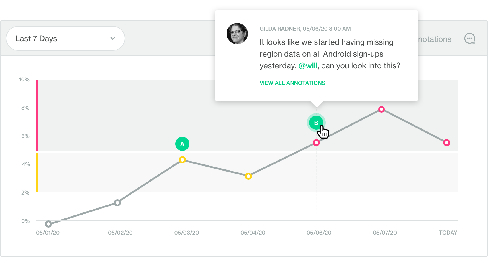

# soda-sql

SQL data monitoring for engineers 

Full control for data engineers
 * Configure what metrics should be computed 
 * Add metric configuration files to your version control system
 * Add custom SQL query metrics
 * Stop your data pipeline based on metric tests

Configure the default metrics for all columns in a dataset (=table)
`./my_warehouse/my_dataset/scan.yaml` :
```yaml
metrics:
    - missing_count, 
    - missing_percentage
    - values_count
    - values_percentage
    - valid_count
    - valid_percentage
    - invalid_count
    - invalid_percentage
    - min
    - max
    - avg
    - sum
    - min_length
    - max_length
    - avg_length
...
```

Customize metrics for each column individually:
```yaml
...
columns:
    ID:
        metrics:
            - distinct
            - non_unique_count
        valid_format: uuid
        tests:
            - non_unique_count == 0
    CATEGORY:
        missing_values:
            - N/A
            - No value
        valid_values:
            - High
            - Medium
            - Low
        tests:
            - missing_percentage < 3.0
            - invalid_count == 0
```

Add custom SQL query metrics
`./my_warehouse/my_dataset/customers_with_expired_zip_code.yaml` :
```yaml
id: customers_with_expired_zip_code
name: Customers with expired zip code
type: failed_rows
sql: |

SELECT
    MD.id,
    MD.name,
    MD.zipcode,
FROM my_dataset as MD
  JOIN zip_codes as ZC on MD.zipcode = ZC.code
WHERE ZC.date_expired IS NOT NULL
```

Add scans to your data pipeline with the command line interface:
```
$ soda scan -env prod ./soda/metrics my_warehouse my_dataset
Soda 1.0 scan for dataset my_dataset on prod my_warehouse
  | SELECT column_name, data_type, is_nullable
  | FROM information_schema.columns
  | WHERE lower(table_name) = 'customers'
  |   AND table_catalog = 'datasource.database'
  |   AND table_schema = 'datasource.schema'
  - 0.256 seconds
Found 4 columns: ID, NAME, CREATE_DATE, COUNTRY
  | SELECT
  |  COUNT(*),
  |  COUNT(CASE WHEN ID IS NULL THEN 1 END),
  |  COUNT(CASE WHEN ID IS NOT NULL AND ID regexp '\b[0-9a-f]{8}\b-[0-9a-f]{4}-[0-9a-f]{4}-[0-9a-f]{4}-\b[0-9a-f]{12}\b' THEN 1 END),
  |  MIN(LENGTH(ID)),
  |  AVG(LENGTH(ID)),
  |  MAX(LENGTH(ID)),
  | FROM customers
  - 0.557 seconds
row_count : 23543
missing   : 23
invalid   : 0
min_length: 9
avg_length: 9
max_length: 9

...more queries...

Sending measurements to cloud.soda.io...
Done - Took 23.307 seconds
```

Upload and store metrics over time on a free Soda cloud account:

