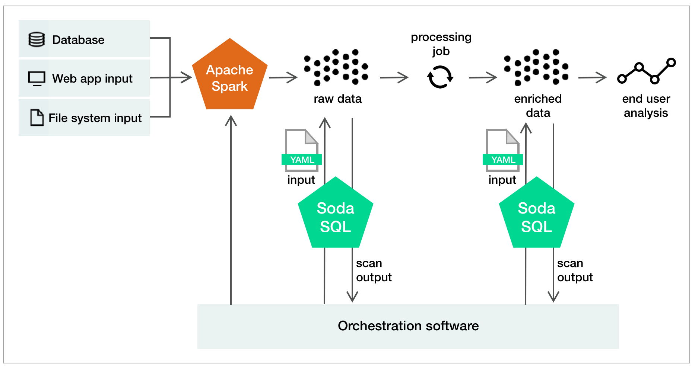

# Configure orchestrated scans

Integrate Soda SQL with a **data orchestration tool** such as, Airflow, Dagster, or dbt, to automate and schedule your search for "bad" data. 

Not only can you schedule [scans](#scan) of [warehouse](#warehouse) [tables](#table), you can also configure actions that the orchestration tool can take based on scan output. For example, if the output of a scan reveals a large number of failed tests, the orchestration tool can automatically block "bad" data from contaminating your data pipeline. 

Use the results of a Soda SQL scan to instruct your orchestration tool to:
- block "bad" data from entering your data pipeline (for testing), or,
- allow data to enter the pipeline (for monitoring).

{:height="800px" width="800px"}

Follow the instructions that correspond to your data orchestration tool:

[Apache Airflow using PythonVirtualenvOperator](#apache-airflow-using-pythonvirtualenvoperator)<br />
[Apache Airflow using PythonOperator](#apache-airflow-using-pythonoperator)<br />
[Apache Airflow using BashOperator](#apache-airflow-using-bashoperator)<br />
[Prefect using a custom Task](#prefect-using-a-custom-task)<br />
More coming soon
<br />


## Apache Airflow using PythonVirtualenvOperator

Though you can install Soda SQL directly in your Airflow environment, the instructions below use PythonVirtualenvOperator to run Soda SQL scans in a different environment. This keeps Soda SQL software separate to prevent any dependency conflicts. 

1. Install `virtualenv` in your main Airflow environment.
2. Set the following variables in your Airflow environment.
```python
warehouse_yml = Variable.get('soda_sql_warehouse_yml_path')
scan_yml = Variable.get('soda_sql_scan_yml_path')
```
3. Configure as per the following example.

```python
from airflow import DAG
from airflow.models.variable import Variable
from airflow.operators.python import PythonVirtualenvOperator
from airflow.operators.dummy import DummyOperator
from airflow.utils.dates import days_ago
from datetime import timedelta

default_args = {
    'owner': 'soda_sql',
    'retries': 1,
    'retry_delay': timedelta(minutes=5),
}


def run_soda_scan(warehouse_yml_file, scan_yml_file):
    from sodasql.scan.scan_builder import ScanBuilder
    scan_builder = ScanBuilder()
    # Optionally you can directly build the warehouse dict from Airflow secrets/variables
    # and set scan_builder.warehouse_dict with values.
    scan_builder.warehouse_yml_file = warehouse_yml_file
    scan_builder.scan_yml_file = scan_yml_file
    scan = scan_builder.build()
    scan_result = scan.execute()
    if scan_result.has_test_failures():
        failures = scan_result.get_test_failures_count()
        raise ValueError(f"Soda Scan found {failures} errors in your data!")


dag = DAG(
    'soda_sql_python_venv_op',
    default_args=default_args,
    description='A simple Soda SQL scan DAG',
    schedule_interval=timedelta(days=1),
    start_date=days_ago(1),
)

ingest_data_op = DummyOperator(
    task_id='ingest_data'
)

soda_sql_scan_op = PythonVirtualenvOperator(
    task_id='soda_sql_scan_demodata',
    python_callable=run_soda_scan,
    requirements=["soda-sql==2.0.0b10"],
    system_site_packages=False,
    op_kwargs={'warehouse_yml_file': warehouse_yml,
               'scan_yml_file': scan_yml},
    dag=dag
)

publish_data_op = DummyOperator(
    task_id='publish_data'
)

ingest_data_op >> soda_sql_scan_op >> publish_data_op

```

## Apache Airflow using PythonOperator

If you do not want to use a PythonVirtualenvOperator, which installs Soda SQL on invocation, you can use PythonOperator. 
 
1. Set the following variables in your Airflow environment.
```python
warehouse_yml = Variable.get('soda_sql_warehouse_yml_path')
scan_yml = Variable.get('soda_sql_scan_yml_path')
```
2. Configure as per the following example.

```python
from airflow import DAG
from airflow.models.variable import Variable
from airflow.operators.python import PythonOperator
from airflow.operators.dummy import DummyOperator
from airflow.utils.dates import days_ago
from datetime import timedelta
from sodasql.scan.scan_builder import ScanBuilder
from airflow.exceptions import AirflowFailException

# Make sure that this variables are set in your Airflow
warehouse_yml = Variable.get('soda_sql_warehouse_yml_path')
scan_yml = Variable.get('soda_sql_scan_yml_path')

default_args = {
    'owner': 'soda_sql',
    'retries': 1,
    'retry_delay': timedelta(minutes=5),
}


def run_soda_scan(warehouse_yml_file, scan_yml_file):
    scan_builder = ScanBuilder()
    scan_builder.warehouse_yml_file = warehouse_yml_file
    scan_builder.scan_yml_file = scan_yml_file
    scan = scan_builder.build()
    scan_result = scan.execute()
    if scan_result.has_test_failures():
        failures = scan_result.get_test_failures_count()
        raise AirflowFailException(f"Soda Scan found {failures} errors in your data!")


dag = DAG(
    'soda_sql_python_op',
    default_args=default_args,
    description='A simple Soda SQL scan DAG',
    schedule_interval=timedelta(days=1),
    start_date=days_ago(1),
)

ingest_data_op = DummyOperator(
    task_id='ingest_data'
)

soda_sql_scan_op = PythonOperator(
    task_id='soda_sql_scan_demodata',
    python_callable=run_soda_scan,
    op_kwargs={'warehouse_yml_file': warehouse_yml,
               'scan_yml_file': scan_yml},
    dag=dag
)

publish_data_op = DummyOperator(
    task_id='publish_data'
)

ingest_data_op >> soda_sql_scan_op >> publish_data_op

```

## Apache Airflow using BashOperator

Invoke a Soda SQL scan using Airflow BashOperator.

1. Install Soda SQL in your Airflow environment. 
2. Set the following variables in your Airflow environment.
```python
warehouse_yml = Variable.get('soda_sql_warehouse_yml_path')
scan_yml = Variable.get('soda_sql_scan_yml_path')
```
3. Configure as per the following example.

```python
# In this  DAG, the `soda_sql_scan_demodata` task fails when the tests you
# defined for the `demodata` table fail. This prevents the `publish_data_op` from
# running. You can further customize the bash command to use different Soda SQL command
# options, such as passing variables to the `soda scan` command.

from airflow import DAG
from airflow.models.variable import Variable
from airflow.operators.bash import BashOperator
from airflow.operators.dummy import DummyOperator
from airflow.utils.dates import days_ago
from datetime import timedelta

# Use the same variable name that you used when you set your Airflow variables
soda_sql_project_path = Variable.get('soda_sql_project_path')

default_args = {
    'owner': 'soda_sql',
    'retries': 1,
    'retry_delay': timedelta(minutes=5),
}

dag = DAG(
    'soda_sql_scan',
    default_args=default_args,
    description='A simple Soda SQL scan DAG',
    schedule_interval=timedelta(days=1),
    start_date=days_ago(1),
)
# A dummy operator to simulate data ingestion
ingest_data_op = DummyOperator(
    task_id='ingest_data'
)

# Soda SQL Scan which runs the appropriate table scan for the ingestion
soda_sql_scan_op = BashOperator(
    task_id='soda_sql_scan_demodata',
    bash_command=f'cd {soda_sql_project_path} && soda scan warehouse.yml tables/demodata.yml',
    dag=dag
)

# A dummy operator to simulate data publication when the Soda SQL Scan task is successful
publish_data_op = DummyOperator(
    task_id='publish_data'
)

ingest_data_op >> soda_sql_scan_op >> publish_data_op
```

## Prefect using a custom Task

Create a custom Prefect Task to run Soda SQL scans programmatically.

1. Install Soda SQL and Prefect in your environment.
2. Make sure that Soda SQL is available in the environment in whic your Prefect flow runs. For example, if you use Docker as the storage backend, you must provide Soda SQL as a dependency. Refer to [Prefect documentation](https://docs.prefect.io/core/concepts/flows.html).
3. Define a custom Prefect Task to wrap Soda SQL and use it in your Prefect Flow. Refer to the following basic implementation of a SodaSQLScan Task.
   
```python
from sodasql.scan.scan_builder import ScanBuilder
from prefect import Task
from prefect.utilities.tasks import defaults_from_attrs
from typing import Dict, Union
class SodaSQLScan(Task):
    """
    SodaSQLScan
    """
    def __init__(
        self,
        scan_def: Union[Dict, str] = None,
        warehouse_def: Union[Dict, str] = None,
        **kwargs
    ):
        """
        Args:
            scan_def: Soda SQL scan file path or dictionary
            warehouse_def: Soda SQL warehouse file path or dictionary
            **kwargs:
        """
        self.scan_builder = ScanBuilder()
        self._set_scan_def(scan_def=scan_def)
        self._set_warehouse_def(warehouse_def=warehouse_def)
        super().__init__(**kwargs)
        
    def _set_scan_def(self, scan_def: Union[Dict, str]) -> None:
        """
        Args:
            scan_def: Soda SQL scan file path or dictionary
        Returns:
        """
        self.scan_def = scan_def
        if isinstance(scan_def, str):
            self.scan_builder.scan_yml_file = scan_def
        elif isinstance(scan_def, dict):
            self.scan_builder.scan_yml_dict = scan_def
            
    def _set_warehouse_def(self, warehouse_def: Union[Dict, str]) -> None:
        """
        Args:
            warehouse_def: Soda SQL warehouse file path or dictionary
        Returns:
        """
        self.warehouse_def = warehouse_def
        if isinstance(warehouse_def, str):
            self.scan_builder.warehouse_yml_file = warehouse_def
        elif isinstance(warehouse_def, dict):
            self.scan_builder.warehouse_yml_dict = warehouse_def
            
    @defaults_from_attrs("scan_def", "warehouse_def")
    def run(self, scan_def: Union[Dict, str], warehouse_def: Union[Dict, str]) -> Dict:
        """
        Args:
            scan_def: Soda SQL scan file path or dictionary
            warehouse_def: Soda SQL warehouse file path or dictionary
        Returns: Soda SQL scan results as JSON object
        """
        if scan_def is None:
            raise ValueError(
                "Scan definition cannot be None. \
                Please provide either a path to a scan definition file or a scan definition dictionary"
            )
        if warehouse_def is None:
            raise ValueError(
                "Warehouse definition cannot be None. \
                Please provide either a path to a warehouse definition file or a warehouse definition dictionary"
            )
        scan = self.scan_builder.build()
        return scan.execute().to_json()
```

In your Prefect Flow, call the Soda SQL Task as per the following example.

```python
import SodaSQLScan

from prefect import Flow


dq_task = SodaSQLScan(
    scan_def="/path/to/scan.yml",
    warehouse_def="/path/to/warehouse.yml"
)

with Flow(name="DQ Sample") as f:

    f.add_task(dq_task)

# run Flow locally, useful only for debugging
# f.run()

# Register flow to Prefect Server/Cloud
f.register()
```

## Go further

- If you want to write integration instructions for your favorite data orchestration tool, please contribute to our open-source docs! [Post a note on GitHub](https://github.com/sodadata/soda-sql/discussions) to let us know your plans.
- Need help? [Post your questions on GitHub](https://github.com/sodadata/soda-sql/discussions)
or [join our Slack community](https://join.slack.com/t/soda-community/shared_invite/zt-m77gajo1-nXJF7JtbbRht2zwaiLb9pg)
- Learn how to configure [programmatic Soda SQL scans]().
