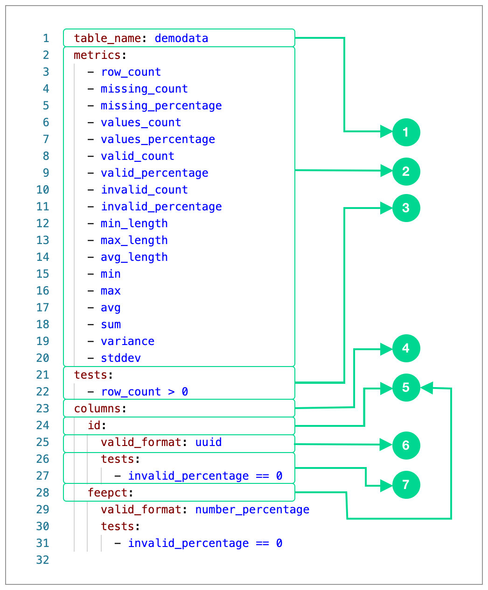

# Scan YAML

A **scan** is a Soda SQL command that uses SQL queries to extract information about data in a database table. 

Instead of laboriously accessing your database and then manually defining SQL queries to analyze the data in tables, you can use a much simpler Soda SQL scan. First, you configure scan metrics and tests in a **Scan YAML** file, then Soda SQL uses the input from that file to prepare, then run SQL queries against your data.

## Create a Scan YAML file

You need to create a **Scan YAML** file for every table in your database that you want to scan. If you have 20 tables in your database, you need 20 YAML files, each corresponding to a single table. 

You can create Scan YAML files yourself, but the CLI command ``soda analyze`` sifts through the contents of your database and automatically prepares a Scan YAML file for each table. Soda SQL puts the YAML files in the ``/tables`` directory which is in the same directory as your ``warehouse.yml`` file. In the example below, Soda SQL created a Scan YAML file named ``demodata.yml`` and put it in the ``/tables`` directory.

In your command-line interface, navigate to the directory that contains your ``warehouse.yml`` file, then execute the following command:

```shell
soda analyze
```

Output:

```shell
  | Analyzing warehouse.yml ...
  | Querying warehouse for tables
  | Creating tables directory tables
  | Executing SQL query: 
SELECT table_name 
FROM information_schema.tables 
WHERE lower(table_schema)='public'
  | SQL took 0:00:00.008511
  | Executing SQL query: 
SELECT column_name, data_type, is_nullable 
FROM information_schema.columns 
WHERE lower(table_name) = 'demodata' 
  AND table_catalog = 'sodasql' 
  AND table_schema = 'public'
  | SQL took 0:00:00.013018
  | Executing SQL query: 
  ...
    | SQL took 0:00:00.008593
  | Creating tables/demodata.yml ...
  | Next run 'soda scan warehouse.yml tables/demodata.yml' to calculate measurements and run tests
```

If you decide to create your own Scan YAML files manually, best practice dictates that you name the YAML file using the same name as the table in your database. 

## Anatomy of the Scan YAML file

When it creates your Scan YAML file, Soda SQL pre-populates it with the ``test`` and ``metric`` configurations it deemed useful based on the data in the table it analyzed. You can keep those configurations intact and use them to run your scans, or you can adjust or add to them to fine tune the tests Soda SQL runs on your data.  

The following describes the contents of a Scan YAML file that Soda SQL created and pre-populated.

{:height="440px" width="440px"}


**1** - The value of **table_name** identifies a SQL table in your database. If you were writing a SQL query, it is the value you would supply for ``FROM``.

**2** - A **metric** is a property of the data in your database.  A **measurement** is the value for a metric that Soda SQL obtains during a scan. For example, in ``row_count = 5``, ``row_count`` is the metric and ``5`` is the measurement.

**3** - A **test** is a Python expression that, during a scan, checks for metrics that match the parameters defined for a measurement. As a result of a scan, a test either passes or fails. For example, the test ``row_count > 0`` checks to see if the table has at least one row. If the test passes, it means the table has at least one row; if the test fails, it means the table has no rows, which means that the table is empty. Tests in this part of the YAML file apply to all columns in the table. A single Soda SQL scan can run many tests on the contents of the whole table.

**4** - A **column** identifies a SQL column in your table. Use column names to configure tests against individual columns in the table. A single Soda SQL scan can run many tests in many columns.

**5** - **``id``** and **``feepct``** are column names that identify specific columns in this table. 

**6** - The value of the **column configuration key** ``valid_format`` identifies the only form of data in the column that Soda SQL recognizes as valid during a scan. In this case, any row in the ``id`` column that contains data that is UUID format (universally unique identifier) is valid; anything else is invalid.

**7** - Same as #3, except the tests in the ``column`` section of the YAML file run only against the contents of the single, identified column. In this case, the test``invalid_percentage == 0`` checks to see if all rows in the ``id`` column contain data in a valid format. If the test passes, it means that 0% of the rows contain data that is invalid; if the test fails, it means that more than 0% of the rows contain invalid data, which is data that is in non-UUID format. 

## Scan YAML configuration keys

The table below describes all of the top level configuration keys you can use to customize your scan. 

| Key     | Description | Required | Default value |
| ----------- | ---------- | -------- | ------------- |
| ``table_name`` | Identifies a SQL table in your database. | required | - |
| ``metrics`` |  A list of all the default metrics that you can use to configure a scan. This list includes both table and column metrics. See [Metrics]() for configuration details.| optional | - |
| ``columns`` | The section of the Scan YAML file in which you define tests and metrics that apply to individual columns. See [Metrics]() for configuration details.| optional | - |
| ``sql_metrics`` | The section of the Scan YAML file in which you define custom sql queries to run during a scan. You can apply ``sql_metrics`` to all data in the table, or data in individual columns. See [Metrics]() for configuration details.| optional | - | 
| ``filter`` | A SQL expression that Soda SQL adds to the ``WHERE`` clause in the query. Use ``filter`` to pass variables, such as date, into a scan. Uses [Jinja](https://jinja.palletsprojects.com/en/2.11.x/) as the templating language. See [Filtering]() for configuration details.| optional | - |
| ``mins_maxs_limit`` | Defines the maximum number of elements for the ``mins`` metric. | optional | 5 |
| ``frequent_values_limit`` | Defines the maximum number of elements for the ``maxs`` metric. | optional | 5 |
| ``sample_percentage`` | Defines a limit to the number of rows in a table that Soda SQL scans during a scan. (Tested on Postgres only.) | optional | - |
| ``sample_method`` | Defines the sample method Soda SQL uses when you specify a ``sample_percentage``. For Snowflake, the values available for this key are: ``BERNOULLI``, ``ROW``, ``SYSTEM``, and ``BLOCK``. | required, if ``sample_percentage`` is speficied | - |


## Run a scan



When Soda SQL runs a scan, it performs the following actions:
- fetches column metadata (column name, type, and nullable)
- executes a single aggregtion query that computes aggregate metrics for multiple columns, such as ``missing``, ``min``, or ``max``
- for each column, executes:
  - a query for ``distinct_count``, ``unique_count``, and ``valid_count``
  - a query for ``mins`` (list of smallest values)
  - a query for ``maxs`` (list of greatest values)
  - a query for ``frequent_values``
  - a query for ``histograms``

To allow some databases, such as Snowflake, to cache scan results, the column queries use the same Column Table Expression (CTE). This practice aims to improve overall scan performance.

## Scan output

By default, the output of a Soda SQL scan appears in your command line interface. In the example below, Soda SQL executed three tests and all the tests passed. The ``Exit code`` is a process code: 0 indicates success with no test failures; a non-zero number indicates failures.

```shell
  | 2.0.0b18
  | Scanning tables/demodata.yml ...
  | Soda cloud: dev.sodadata.io
  | Executing SQL query: 
SELECT column_name, data_type, is_nullable 
FROM information_schema.columns 
WHERE lower(table_name) = 'demodata' 
  AND table_catalog = 'sodasql' 
  AND table_schema = 'public'
  ...
  | < 200 {}
  | 54 measurements computed
  | 3 tests executed
  | All is good. No tests failed.
  | Exiting with code 0
```

Optionally, if you have a **Soda Cloud** account and you have [connected it to the Soda SQL tool]() in your environment, Soda SQL automatically pushes the scan output to your Soda Cloud account. You can log in to view the Monitor Results; each row in the Monitor Results table represents the output of one scan.

Optionally, you can [programmatically insert]() the output of Soda SQL scans into your data orchestration tool such as Dagster, or Apache Airflow. In your orchestration tool, you can use Soda SQL scan results to block the data pipeline if it encounters bad data, or to run in parallel to surface issues with your data.

## Next

* Learn more about the [warehouse YAML]() file.
* Learn how to configure [metrics]() in your YAML files.
* Learn more about configuring [tests]().
* Learn how to apply [filters]() to your scan.
