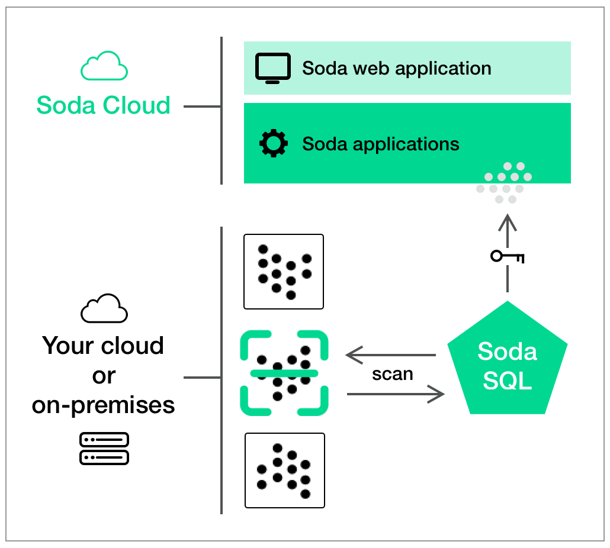

# Soda Cloud architecture

{:height="550px" width="550px"}

**[Soda Cloud](#soda-cloud)** and **[Soda SQL](#soda-sql)** work together to help you monitor your data and alert you when there is a data quality issue. 

Installed in your environment, you use the Soda SQL command-line tool to [scan](#scan) data in your [warehouses](#warehouse). Soda SQL uses a secure API to connect to Soda Cloud. When it completes a scan, it pushes the scan results to your Soda Cloud account where you can log in and examine the details in the web application. Notably, Soda SQL only ever pushes *metadata* to Soda Cloud; all your data stays inside your private network.

When you create a [monitor](#monitor) in Soda Cloud's web application, Soda SQL uses the monitor settings to add new [tests](#test) when it runs a scan on data in a specific warehouse. A monitor is essentially a way to create Soda SQL tests using the web application instead of adjusting [scan YAML file](#scan-yaml) contents directly in your Soda project directory.

## Go further

* Learn more about [How Soda SQL works]().
* Learn more about [Soda SQL scans]().
* Learn more about [Soda SQL tests]() and [Soda Cloud monitors and alerts]().
* [Connect Soda SQL to Soda Cloud]().