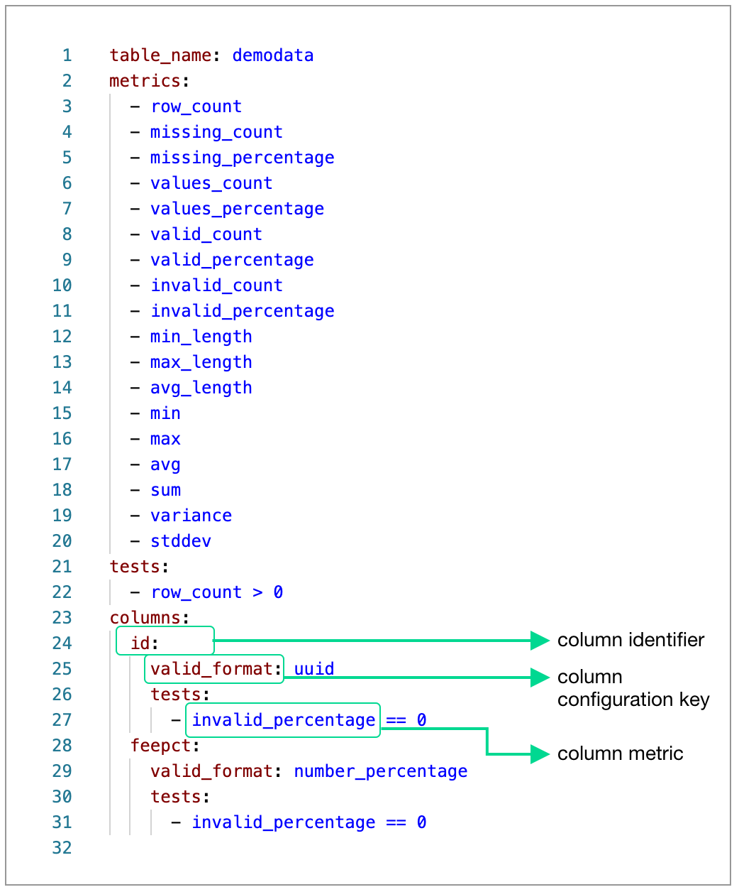

# Metrics

A **metric** is a property of the data in your database. A **measurement** is the value for a metric that Soda SQL obtains during a scan. For example, in `row_count = 5`, `row_count` is the metric and `5` is the measurement. The following sections detail the configuration for metrics you can customize in your [Scan YAML file]().
<br />
<br />

**[Table metrics](#table-metrics)<br />
[Column metrics](#column-metrics)<br />
[SQL metrics](#sql-metrics)<br />**


## Table metrics

Use **table metrics** to define tests in your Scan YAML file that apply to all data in the table during a scan.

{:height="440px" width="440px"}


| Table metric | Description      | 
| ---------- | ---------------- | 
| `row_count` | The total number of rows in a table. | 
| `schema` |  Identifies that the table is part of a schema.   |


#### Example tests using a table metric

```yaml
tests:
  - row_count > 0
```
Checks to see if the table has more than one row. The test passes if the table contains rows.

<br />

```yaml
tests:
  - row_count =5
```
Checks to see if the table has exactly five rows. The test fails if the table contains more or fewer than five rows.

## Column metrics

Use **column metrics** to define tests in your Scan YAML file that apply to specific columns in a table during a scan. 

Where a column metric references a valid or invalid value, or a limit, use the metric in conjunction with a **column configuration**. A Soda SQL scan uses the value of a column configuration key to determine if it should pass or fail a test. See [example](#example-test-using-a-column-metric) below.

{:height="440px" width="440px"}


| Column metric   | Description |  Use with column config key(s) |
| ---------- | ---------------- | ------------------------------ |
| `avg` | The average of the values in a numeric column.  |  - |
| `avg_length` | The average length of a string.  |  -  |
| `distinct` |  The distinct contents in rows in a column.  | -  |
| `duplicate_count` | The number of rows that contain duplicated content. | -  |
| `duplicates` | A group of metrics that Soda SQL computes on a column. Includes `distinct`, `unique_count`, `uniqueness`, `duplicate_count` | `metric_groups` |
| `frequent_values` |  The number of rows that contain content that most frequently occurs in the column. |  - |
| `histogram` |  A histogram calculated on the content of the column.  | - |
| `invalid_count` | The total number of rows that contain invalid content.   | `valid_format` <br /> `valid_regex`  |
| `invalid_percentage` | The total percentage of rows that contain invalid content.  |  `valid_format` <br /> `valid_regex` |
| `length` | A group of metrics that Soda SQL computes on a column. Includes `min_length`, `max_length`, `avg_length` | `metric_groups` |
| `max` | The greatest value in a numeric column.  |  -  |
| `max_length` | The maximum length of a string.  | `valid_max_length`  |
| `maxs` |  The number of rows that qualify as maximum. | `valid_max` |
| `min` | The smallest value in a numeric column.  |  -  |
| `min_length` | The minimum length of a string.  | `valid_min_length`  |
| `mins` |  The number of rows that qualify as minimum. | `valid_min`  |
| `missing` | A group of metrics that Soda SQL computes on a column. Includes `missing_count`, `missing_percentage`, `values_count`, `values_percentage`. | `metric_groups` |
| `missing_count` | The total number of rows that are missing specific content. | `missing_values` <br /> `missing_regex`|
| `missing_percentage` | The total percentage of rows that are missing specific content. | `missing_values` <br /> `missing_regex` |
| `profiling` | A group of metrics that Soda SQL computes on a column. Includes `maxs`, `mins`, `frequent_values`, `histogram` | `metric_groups` |
| `statistics` | A group of metrics that Soda SQL computes on a column. Includes `min`, `max`, `avg sum`, `variance`, `stddev` | `metric_groups` |
| `stddev` |  The standard deviation of a numeric column.   | - |
| `sum` | The sum of the values in a numeric column.   | -  |
| `unique_count` | The number of rows in which the content appears only once in the column.  |  - |
| `uniqueness` | A measure of whether the rows contain unique content.  | -  |
| `valid_count` |  The total number of rows that contain valid content.  | `valid_format` <br /> `valid_regex`   |
| `validity` | A group of metrics that Soda SQL computes on a column. Includes `valid_count`, `valid_percentage`, `invalid_count`, `invalide_percentage` | `metric_groups` |
| `valid_percentage` | The total percentage of rows that contain valid content.  |  `valid_format` <br /> `valid_regex`  |
| `values_count` | The total number of rows that contain content included in a list of valid values. | `valid_values` <br /> `valid_regex`  |
| `values_percentage` | The total percentage of rows that contain content included in a list of valid values. | `valid_values` <br /> `valid_regex` |
| `variance` | The variance of a numerical column.  | -  |


| Column configuration key  | Description  | Values |
| ------------------------- | ------------ | ------ |
| `metric_groups` | Specifies pre-defined groups of metrics that Soda SQL computes for this column. | `duplicates` <br /> `length` <br /> `missing`  <br /> `profiling` <br /> `statistics` <br /> `validity` |
| `metrics` | Specifies extra metrics that Soda SQL computes for this column. |  - |
| `missing_format` | Specifies missing values such as whitespace or empty strings.|   |
| `missing_regex` | Use regex expressions to specify your own custom missing values.| regex |
| `missing_values` | Specifies the values that Soda SQL is to consider missing in list format.| integers in list |
| `tests` | A section that contains the tests that Soda SQL runs on a column during a scan.| - |
| `valid_format` | Specifies a named valid text format.| See Valid_format value table below.  |
| `valid_max` | Specifies a maximum value for valid values. | integer |
| `valid_max_length` | Specifies a maximum string length for valid values. | integer |
| `valid_min` | Specifies a minimum value for valid values. | integer |
| `valid_min_length` | Specifies a minimum string length for valid values. | integer |
| `valid_regex` | Use regex expressions to specify your own custom valid values. | regex |
| `valid_values` | Specifies several valid values in list format. | integers in list |


| Valid_format value | Format | 
| ----- | ------ | 
| `number_whole` | Number is whole. | 
| `number_decimal_point` | Number uses `.` as decimal indicator.|
| `number_decimal_comma` | Number uses `,` as decimal indicator.|
| `number_percentage` | Number is a percentage. |
| `number_money_usd` | Number matches US dollar currency pattern. |
| `number_money_eur` | Number matches Euro currency pattern. |
| `number_money_gbp` | Number matches British pound currency pattern. |
| `number_money_rmb` | Number matches Renminbi yuan currency pattern. |
| `number_money_chf` | Number matches Swiss franc currency pattern. |
| `number_money` | Format matches any of the `number_money_` patterns.|
| `date_eu` | dd/mm/yyyy |
| `date_us` | mm/dd/yyyy |
| `date_inverse` | yyyy/mm/dd |
| `time` | |
| `date_iso_8601` | yyyy-mm-dd |
| `uuid` | universally unique identifier |
| `ip_address` | Four whole numbers separated by `.` |
| `email` | email address |
| `phone_number` |  |
| `credit_card_number` | Four four-digit numbers separated by spaces. |
        

#### Example tests using a column metric

```yaml
columns:
  id:
    valid_format: uuid
    tests:
      - invalid_percentage == 0
  feepct:
    valid_format: number_percentage
    tests:
      - invalid_percentage == 0
```
`invalid_percentage == 0` in column `id` with column configuration `valid_format: uuid` checks the rows in the column named `id` for values that match a uuid (universally unique identifier) format. If the test passes, it means that 0% of the rows contain data that is invalid; if the test fails, it means that more than 0% of the rows contain invalid data, which is data that is in non-UUID format. 


## Metric dependencies

By default, there exist **dependencies** between some metrics. If Soda SQL scans a metric which has dependencies, it includes all the dependent metrics in the scan as well.

| If you use... | ...the scan includes: |
| ------ | ------------ |
| `valid_count` | `missing_count` |
| `valid_percentage` | `missing_percentage` |
| `invalid_count` | `values_count` |
| `invalid_percentage`| `values_percentage`|
| `missing_count` <br /> `missing_percentage` <br /> `values_count` <br /> `values_percentage` | `row_count` |
| `histogram` | `min` <br /> `max` |


## SQL metrics

If the default set of table and column metrics that Soda SQL offers do not quite give you the information you need from a scan, you can use **SQL metrics** to customize your queries. SQL metrics essentially enable you to add SQL queries to your Scan YAML file so that Soda SQL runs them during a scan.


#### Simple example
In your Scan YAML file, use the `sql_metrics` property as a table metric or a column metric. The following simple SQL metric example queries all content in the table to select a single numeric value. 

```yaml
table_name: mytable
sql_metrics:
    - sql: |
        SELECT sum(volume) as total_volume_us
        FROM CUSTOMER_TRANSACTIONS
        WHERE country = 'US'
      tests:
        - total_volume_us > 5000
```
In the example, the computed value (the sum volume of all customer transaction in the United States) becomes a **field** named `total_volume_us`, which, in turn, becomes the name of the metric that you use to define the test Soda SQL that runs on your data. In this case, the test passes if the computed sum of all US transactions exceeds `5000`.

Notice that by default, Soda SQL uses the name of the field as the name of the metric. If you do not want to specify field names inside your SQL queries, you can explicitly name the metrics outside the queries. See [SQL metric names](#sql-metric-names) below. 


#### Multiple example

You can also compute multiple metric values in a single query, then combine them in your tests.  

```yaml
table_name: mytable
sql_metrics:
    - sql: |
        SELECT sum(volume) as total_volume_us,
               min(volume) as min_volume_us,
               max(volume) as max_volume_us
        FROM CUSTOMER_TRANSACTIONS
        WHERE country = 'US'
      tests:
        - total_volume_us > 5000
        - min_volume_us > 20
        - max_volume_us > 100
        - max_volume_us - min_volume_us < 60
```
In this example, the tests pass if:

- the computed sum of all US transactions exceeds `5000`
- the numerical value of the smallest of all US transactions is greater than `20`
- the numerical value of the greatest of all US transactions is greater than `100`
- the numerical value of the difference between the greatest and smallest of US transactions is less than `60`


#### Column SQL metric example

The following example uses SQL metrics to run a query against an individual column named `volume`. When you use SQL metrics in a column, the field you define becomes available to use as a metric in the tests in that column. 

```yaml
table_name: mytable
columns:
    metrics:
        - avg
    volume:
        sql_metrics:
            - sql: |
                SELECT sum(volume) as total_volume_us
                FROM CUSTOMER_TRANSACTIONS
                WHERE country = 'US'
              tests:
                - total_volume_us - avg > 5000
```


### SQL metric names

If you do not want to specify field names inside your SQL queries, you can use the **`metric_names` property** to explicitly name the metrics outside the queries. This property contains a list of values which match the order of values in your `SELECT` statement.

```yaml
table_name: mytable
sql_metrics:
    - sql: |
        SELECT sum(volume),
               min(volume),
               max(volume)
        FROM CUSTOMER_TRANSACTIONS
        WHERE country = 'US'
      metric_names:
        - total_volume_us
        - min_volume_us
        - max_volume_us
      tests:
        - total_volume_us > 5000
        - min_volume_us > 20
        - max_volume_us > 100
        - max_volume_us - min_volume_us < 60
```


### GROUP BY queries in SQL metrics

If your SQL query uses a `GROUP BY` clause, you can use a **`group_by`** property in your SQL metrics to instruct Soda SQL to run each test against each group combination. Set the `group_property` as in the example below.

```yaml
table_name: mytable
sql_metrics:
    - sql: |
        SELECT country,
               sum(volume) as total_volume,
               min(volume) as min_volume,
               max(volume) as max_volume
        FROM CUSTOMER_TRANSACTIONS
        GROUP BY country
      group_fields:
        - country
      tests:
        - total_volume > 5000
        - min_volume > 20
        - max_volume > 100
        - max_volume - min_volume < 60
```


### Variables in SQL metrics

In Soda SQL, you set a **variable** to apply a filter to the data that Soda SQL scans. Often you use a variable to filter the range of a scan by date. (See [Filtering](filtering.md)).  

When you define a variable in your Scan YAML file, Soda SQL applies the filter to all tests *except* tests defined in SQL metrics. To apply a filter to SQL metrics tests, be sure to explicitly define the variable in your SQL query, as in the example below.

```yaml
table_name: mytable
filter: date = DATE '{{ date }}'
sql_metrics:
    - sql: |
        SELECT sum(volume) as total_volume_us
        FROM CUSTOMER_TRANSACTIONS
        WHERE country = 'US' AND date = DATE '{{ date }}'
      tests:
        - total_volume_us > 5000
```


### SQL metrics using file reference

Instead of including all your customized SQL queries in the SQL metrics in your Scan YAML file, you can use **`sql_file`** to reference a relative file.

```yaml
table_name: mytable
sql_metrics:
    - sql_file: mytable_metric_us_volume.sql
      tests:
        - total_volume_us > 5000
```

In this case, the `mytable_metric_us_volume.sql` file contains the following SQL query.

```sql
SELECT sum(volume) as total_volume_us
FROM CUSTOMER_TRANSACTIONS
WHERE country = 'US'
```

## Learn more

* Learn more about the [Scan YAML]() file.
* Learn more about configuring [tests]().
* Learn how to apply [filters]() to your scan.