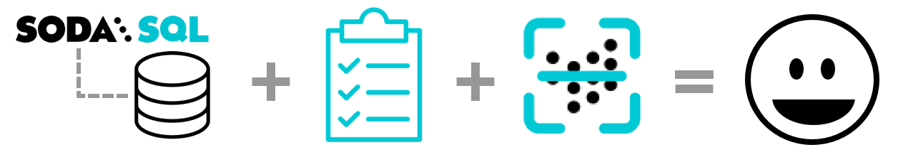
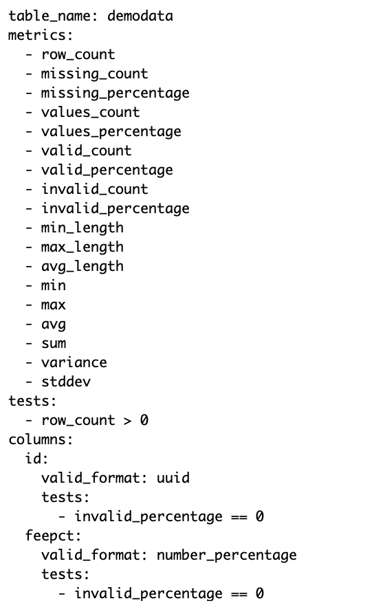

# Quick start tutorial 

Use your command-line interface to **connect** Soda SQL to your database, prepare default **tests** that will surface "bad" data, then run your first **scan** in a few minutes. 
<br />
<br />

{:height="600px" width="600px"}


## Create a sample warehouse (optional)

In the context of Soda SQL, a warehouse represents a SQL engine or database such as Snowflake, AWS Redshift, or PostgreSQL. If you do not have access to a warehouse on your system, you can use Docker to build a sample PostgreSQL warehouse so that you can set up your Soda SQL CLI tool and see it in action. 

All the instructions below reference this sample warehouse in the commands.

1. From your command-line interface, execute the following to build a containerized PostgreSQL warehouse.
```shell
$ docker run --name soda_sql_tutorial_db --rm -d \
    -p 5432:5432 \
    -v soda_sql_tutorial_postgres:/var/lib/postgresql/data:rw \
    -e POSTGRES_USER=sodasql \
    -e POSTGRES_DB=sodasql \
    -e POSTGRES_HOST_AUTH_METHOD=trust \
    postgres:9.6.17-alpine
```
2. Load sample data into your warehouse.
```shell
docker exec soda_sql_tutorial_db \
  sh -c "wget -qO - https://raw.githubusercontent.com/sodadata/soda-sql/main/tests/demo/demodata.sql | psql -U sodasql -d sodasql"
```


## Connect Soda SQL to the warehouse

The instructions below reference the sample warehouse in the commands. Customize the example commands to use your own PostgreSQL warehouse connection details, if you like.

1. From your command-line interface, verify your [installation]() of Soda SQL using the `soda` command.
```shell
$ soda
Usage: soda [OPTIONS] COMMAND [ARGS]...
```
2. Create, then navigate to a new Soda SQL warehouse directory. The example below creates a directory named `soda-sql-tutorial`.
```shell
$ mkdir soda_sql_tutorial
$ cd soda_sql_tutorial
```
3. Use the `soda create` command to create and pre-populate two files that enable you to configure connection details for Soda SQL to access your warehouse: 
* a `warehouse.yml` file which stores access details for your warehouse ([read more]())
* an `env_vars.yml` file which securely stores warehouse login credentials ([read more](#env_vars-yaml))<br />
<br />
Command:
```shell
$ soda create -d sodasql -u sodasql -w soda_sql_tutorial postgres
```
Output:
```shell
  | Soda CLI version ...
  | Creating warehouse YAML file warehouse.yml ...
  | Creating /Users/tom/.soda/env_vars.yml with example env vars in section soda_sql_tutorial
  | Review warehouse.yml by running command
  |   cat warehouse.yml
  | Review section soda_sql_tutorial in ~/.soda/env_vars.yml by running command
  |   cat ~/.soda/env_vars.yml
  | Then run the soda analyze command
```
4. Optionally, use the following commands  to review the contents of the two YAML files you created. You do not need to adjust any contents as Soda SQL has already configured the warehouse connection details.
* `cat ./warehouse.yml`
* `cat ~/.soda/env_vars.yml`


## Prepare default tests

1. Use the `soda analyze` command to get Soda SQL to sift through the contents of your warehouse and automatically prepare a scan YAML file for each table. Soda SQL puts the YAML files in a new `/tables` directory in the warehouse directory you created. Read more about [scan YAML](create-a-scan-yaml-file) files.<br />
<br />
Command:
```shell
soda analyze
```
Output:
```
  | Analyzing warehouse.yml ...
  | Querying warehouse for tables
  | Creating tables directory tables
  | Executing SQL query:
SELECT table_name
FROM information_schema.tables
WHERE lower(table_schema)='public'
  | SQL took 0:00:00.007998
  | Creating tables/demodata.yml ...
  | Executing SQL query:
...
  | SQL took 0:00:00.000647
  | Next run 'soda scan warehouse.yml tables/demodata.yml' to calculate measurements and run tests
```
2. Use the following command to review the contents of the new scan YAML file that Soda SQL created and named `demodata.yml`.<br />
<br />
Command:
```shell
cat ./tables/demodata.yml
```
Output:<br />
{:height="340px" width="340px"}
3. Note the three tests that Soda SQL configured in `demodata.yml`. When it created this file, Soda SQL pre-populated it with the `test` and `metric` configurations it deemed useful based on the data in the table it analyzed. Read more about the [Anatomy of the scan YAML file](#anatomy-of-the-scan-yaml-file).

## Run a scan

1. Use the `soda scan` command to run tests against the data in the demodata warehouse. As input, the command requires the name of the warehouse to scan, and the path and name of the table in the warehouse. <br />
<br />
Command:
```shell
soda scan warehouse.yml tables/demodata.yml
```
2. Examine the output of the command, in particular the lines at the bottom that indicate the results of the tests Soda SQL ran against your data. In this example, all the tests passed which indicates that there are no issues with the data.<br />
<br />
Output:
```shell
  | Soda CLI version 2.0.0 beta
  | Scanning demodata in ./soda_sql_tutorial ...
  | Environment variable POSTGRES_PASSWORD is not set
  | Executing SQL query:
SELECT column_name, data_type, is_nullable
FROM information_schema.columns
WHERE lower(table_name) = 'demodata'
  AND table_catalog = 'sodasql'
  AND table_schema = 'public'
  | SQL took 0:00:00.029199
  | 6 columns:
  |   id character varying
  |   name character varying
  |   size integer
  |   date date
  |   feepct character varying
  |   country character varying
  | Query measurement: schema = id character varying, name character varying, size integer, date date, feepct character varying, country character varying
  | Executing SQL query:
SELECT
  COUNT(*),
  COUNT(id),
  MIN(LENGTH(id)),
  MAX(LENGTH(id)),
  COUNT(name),
  MIN(LENGTH(name)),
  MAX(LENGTH(name)),
  COUNT(size),
...
  | missing_count(country) = 0
  | values_percentage(country) = 100.0
  | All good. 38 measurements computed. No tests failed.
```
3. If you used Docker to create a sample PostgreSQL warehouse for this tutorial, be sure to execute the following commands to stop the container.
```shell
$ docker stop soda_sql_tutorial_db
$ docker volume rm soda_sql_tutorial_postgres
```

## Go further

* [Post your feedback](https://github.com/sodadata/soda-sql/discussions) about this tutorial!
* Learn more about [How Soda SQL works]().
* Learn more about the [scan YAML file]() and how to [run scans](#run-a-scan).
* Learn more about configuring [tests]() and [metrics]().
* Configure your warehouse YAML to [connect to your warehouse]().
