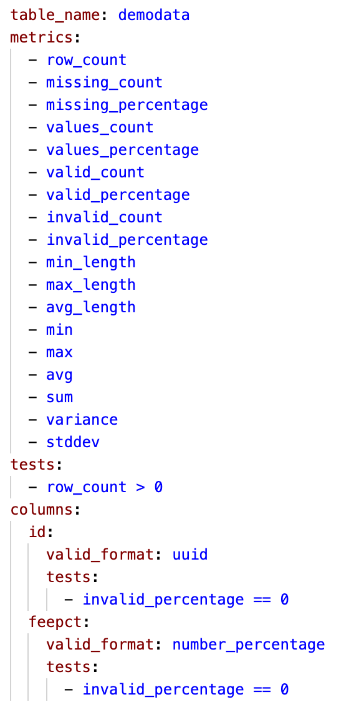

# Configure Soda SQL

After you [install Soda SQL](), you must create files and configure a few settings before you can run a scan. 

## Overview 

1. Create a [warehouse directory](#warehouse-directory) in which to store your warehouse YAML file and `/tables` directory.
2. Create a [warehouse YAML file](#warehouse-yaml) and an [env_vars YAML file](#env_vars-yaml), then adjust the contents of each to input your [warehouse](#warehouse) connection details. 
3. Create a [scan YAML file](#scan-yaml) for each [table](#table) that exists in your warehouse. The scan YAML files store the test criteria that Soda SQL uses to prepare SQL queries that [scan](#scan) your warehouse.
4. Adjust the contents of your new scan YAML files to add the [tests](#test) you want to run on your data to check for quality.

Consider following the [Quick start tutorial]() that guides you through configuration and scanning.

## Configure

1. Use your command-line interface to create, then navigate to a new Soda SQL warehouse directory in your environment. The warehouse directory stores your warehouse YAML files and `/tables` directory. The example below creates a directory named `soda_warehouse_directory`.<br />
<br />
```shell
$ mkdir soda_warehouse_directory
$ cd soda_warehouse_directory
```
2. Use the `soda create` command to create and pre-populate two files that enable you to configure connection details for Soda SQL to access your warehouse: 
* a `warehouse.yml` file which stores access details for your warehouse ([read more]())
* an `env_vars.yml` file which securely stores warehouse login credentials ([read more](#env_vars-yaml))<br />
<br />
```shell
$ soda create -d yourdbname -u dbusername -w soda_warehouse_directory typeofdb
```
3. Use a code editor to open the `warehouse.yml` file that Soda SQL created and put in your warehouse directory. Refer to [Set warehouse configurations]() to adjust the configuration details according to the type of warehouse you use, then save the file.<br />
<br />
Example warehouse YAML
```shell
name: soda_warehouse_directory
connection:
  type: postgres
  host: localhost
  username: env_var(POSTGRES_USERNAME)
  password: env_var(POSTGRES_PASSWORD)
  database: sodasql
  schema: public
```
4. Use a code editor to open the `env_vars.yml` that Soda SQL created and put in your local user home directory as a hidden file (`~/.soda/env_vars.yml`). Input your warehouse login credentials then save the file.<br />
<br />
Example env_vars YAML
```shell
soda_warehouse_directory:
  POSTGRES_USERNAME: someusername
  POSTGRES_PASSWORD: somepassword
```
5. In your command-line interface, use the `soda analyze` command to get Soda SQL to sift through the contents of your warehouse and automatically prepare a scan YAML file for each table. Soda SQL uses the name of the table to name each YAML file which it puts a new `/tables` directory in the warehouse directory. <br />
<br />
```shell
soda analyze
```
6. Use a code editor to open one of your new scan YAML files. Soda SQL pre-populated the YAML file with default metrics and tests that it deemed useful for the kind of data in the table. See [scan YAML](#anatomy-of-the-scan-yaml-file). <br /> Adjust the contents of the YAML file to define the tests that you want Soda SQL to conduct when it runs a scan on this table in your warehouse. Refer to [Metrics]() and [Tests]() for details. <br />
<br />
Example scan YAML<br />
{:height="275px" width="275px"}
7. With your configuration complete, [run your first scan](#run-a-scan).


## Go further

* Learn more about [How Soda SQL works]().
* Learn more about the [scan YAML file]().
* Learn more about configuring [tests]() and [metrics]().